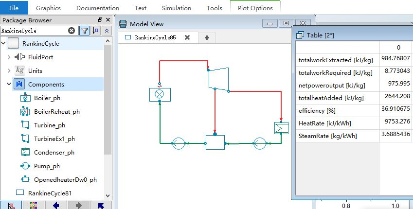

# SimRankine

[](https://zenodo.org/badge/latestdoi/306221786)

The SimRankine is the demo steady-state simulator of Rankine cycle in Python, C++ and Modelica

* [Python with the sequential-modular approach](./python)

* [C++ with the sequential-modular approach](./cpp)

* [Modelica](./mo)

## Python

### Prerequisites：seuif97

```bash
python -m pip install seuif97
```
### Run
 
type `python  rankineapp.py` in the terminal of `./python` 

```bash
python  rankineapp.py
```

## C++

### Prerequisites：the seuif97 dynamic library

1. building the dynamic library : https://github.com/thermalogic/RustSEUIF97
2. put the dynamic library  in `./cpp/bin`

### Run

In the terminal of `./cpp` 

* make 

```bash
make
```

* cmake 

```bash
cmake -B ./build/   
cmake --build ./build/ --config Release
```
## Modelica

**Prerequisites**：Dymola



## The Example Rankine cycles

Michael J. Moran, Howard N. Shapiro, Daisie D. Boettner, Margaret B. Bailey. Fundamentals of Engineering Thermodynamics(7th Edition). John Wiley & Sons, Inc. 2011

Chapter 8 : Vapour Power Systems 

[The Jupyter Notebook of Example Rankine Cycles](https://github.com/PySEE/PyRankine)

* Example 8.1: Analyzing an Ideal Rankine Cycle, P438
* Example 8.2: Analyzing a Rankine Cycle with Irreversibilities, P444
* Example 8.3: Evaluating Performance of an Ideal Reheat Cycle, P449
* Example 8.4: Evaluating Performance of a Reheat Cycle with Turbine Irreversibility, P451
* Example 8.5: The Regenerative Cycle with Open Feedwater Heater, P456
  
## Cite as

* Cheng Maohua. (2021). SimRankine: the demo steady-state simulator of Rankine cycle in Python, C++ and Modelica (2.0.0). Zenodo. https://doi.org/10.5281/zenodo.4585581
