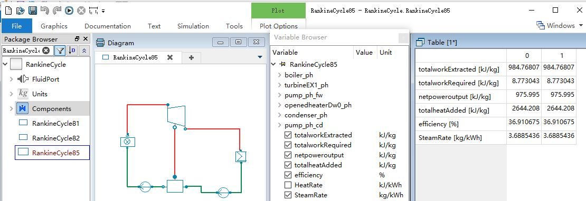

# The Simple Rankine Cycle Simulator in Modelica

## Example Rankine Cycles

Michael J. Moran, Howard N. Shapiro, Daisie D. Boettner, Margaret B. Bailey. Fundamentals of Engineering Thermodynamics(7th Edition). John Wiley & Sons, Inc. 2011

Chapter 8 : Vapour Power Systems 

[The Jupyter Notebook of Example Rankine Cycles](https://github.com/PySEE/PyRankine)

* Example 8.1: Analyzing an Ideal Rankine Cycle, P438
* Example 8.2: Analyzing a Rankine Cycle with Irreversibilities, P444
* Example 8.3: Evaluating Performance of an Ideal Reheat Cycle, P449
* Example 8.4: Evaluating Performance of a Reheat Cycle with Turbine Irreversibility, P451
* Example 8.5: The Regenerative Cycle with Open Feedwater Heater, P456
  

## Cite as

Cheng Maohua. (2020, October 24). thermalogic/SimRankine 1.0.2 (Version 1.0.2). Zenodo. http://doi.org/10.5281/zenodo.4124811